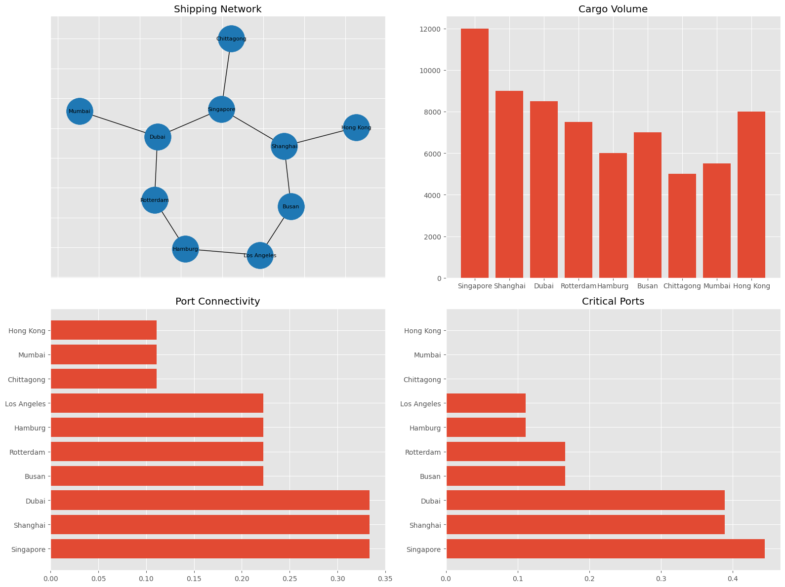

## MaritimeFlowX: A Spatial-Temporal Network Framework for Global Shipping Dynamics, Risk, and Sustainability

## Project Overview

**MaritimeFlowX** is a geospatial and network science-based analytical framework designed to model, analyze, and optimize global maritime shipping networks.

It integrates **GIS, Graph Theory, and Supply Chain Analytics** to study global trade connectivity, cargo flow dynamics, port importance, network resilience, and environmental impact.

This project is developed using Python in Google Colab and is suitable for **research, academic publication, and portfolio demonstration**.

---

## Research Objectives

- Construct a global maritime shipping network using port-level geospatial data  
- Analyze cargo flow intensity across major international trade routes  
- Identify critical maritime hubs using centrality measures  
- Detect trade communities and regional shipping clusters  
- Evaluate network resilience under port failure scenarios  
- Estimate carbon emissions from global shipping routes  
- Visualize global logistics using GIS-based mapping techniques  

---

## Key Features

### Network Science
- Degree Centrality Analysis  
- Betweenness Centrality  
- K-Core Decomposition  
- Community Detection (Modularity-based clustering)  

### Logistics Intelligence
- Cargo flow modeling (TEU simulation)  
- Route importance ranking  
- Strategic port identification  

### Geospatial Analytics
- World port mapping  
- Shipping route visualization  
- Interactive GIS network mapping (Folium)  

### Sustainability Analysis
- Carbon emission estimation per route  
- Green shipping corridor identification  
- Environmental impact assessment  

### Risk & Resilience
- Port vulnerability index  
- Network failure simulation  
- Cascading disruption analysis  

---

## Methodology

1. **Data Construction**  
   Synthetic global port and route dataset generation  

2. **Graph Modeling**  
   Ports represented as nodes, shipping routes as weighted edges  

3. **Network Analysis**  
   Centrality metrics and community detection algorithms  

4. **Spatial Visualization**  
   GIS-based mapping of ports and shipping routes  

5. **Risk Modeling**  
   Simulation of port failures and network disruption  

6. **Sustainability Assessment**  
   Carbon emission estimation per shipping route  

---

## Future Improvements

- Integration with real AIS vessel tracking data  
- Real-time shipping congestion monitoring  
- Machine learning-based demand forecasting  
- Digital twin of global maritime logistics  
- Climate-aware route optimization  

---

## Acknowledgements

- NetworkX Documentation  
- Open geospatial concepts  
- Global logistics research literature  

© mdkhademali